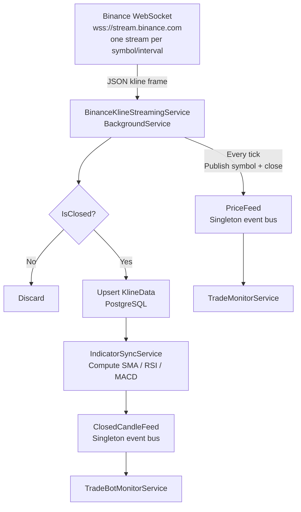
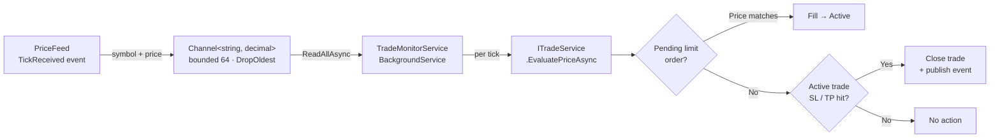
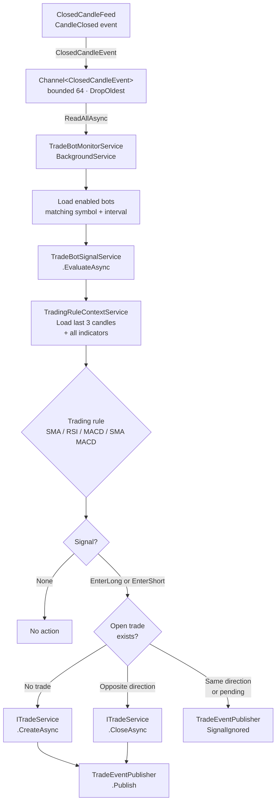
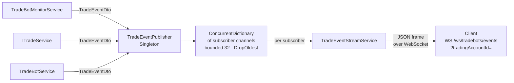
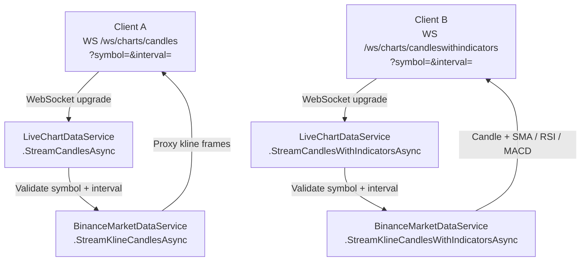
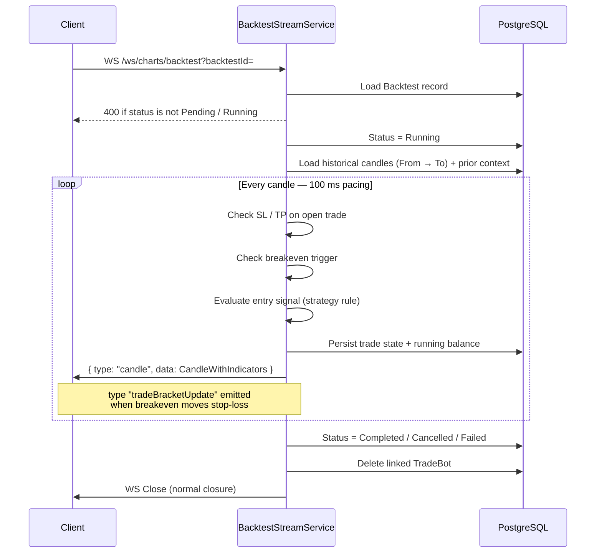
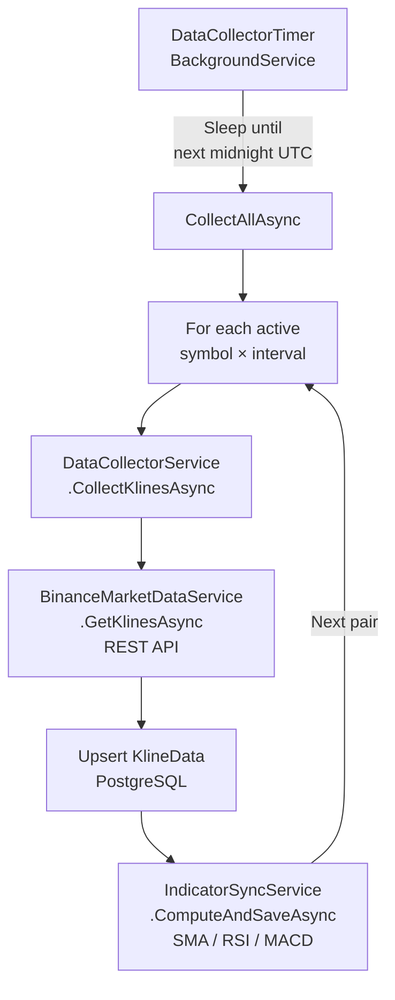

# TraderAlgoAPI

ASP.NET Core backend API for algorithmic trading — collects K-line data from Binance, serves it to an Angular frontend, and integrates with Kronos for AI-powered candle forecasting.

**Stack:** C# · .NET 10 · ASP.NET Core · Entity Framework Core · PostgreSQL (Supabase) · Binance API

---

## Table of Contents

- [Architecture](#architecture)
- [Data Streaming](#data-streaming)
  - [Live Kline Ingest](#1-live-kline-ingest)
  - [Price Tick Monitor](#2-price-tick-monitor)
  - [Bot Signal Evaluation](#3-bot-signal-evaluation)
  - [Trade Event Stream](#4-trade-event-stream)
  - [Live Chart Streams](#5-live-chart-streams)
  - [Backtest Simulation Stream](#6-backtest-simulation-stream)
  - [Daily Data Collection](#7-daily-data-collection)
- [API Reference](#api-reference)
- [Trading Strategies](#trading-strategies)
  - [SMA](#sma-simple-moving-average)
  - [RSI](#rsi-relative-strength-index)
  - [MACD](#macd-moving-average-convergence-divergence)
  - [SMA MACD](#sma-macd)
- [Trade Bots](#trade-bots)
- [Backtests](#backtests)
- [Kronos](#kronos)
  - [Overview](#overview)
  - [Models](#models)
  - [Core API](#core-api)
  - [Web UI](#web-ui)
  - [Building Blocks](#building-blocks)
  - [Integration Points](#integration-points)
- [Kronos Connector](#kronos-connector)
  - [Hosting](#hosting)
  - [Project Structure](#project-structure)
  - [Upstream Updates](#upstream-updates)
  - [Setup Guide](#setup-guide)

---

## Architecture

```
┌─────────────────────────────────────────────────────────────┐
│                        Vercel                               │
│                   Angular Frontend                          │
└──────────────────────────┬──────────────────────────────────┘
                           │ HTTP
┌──────────────────────────▼──────────────────────────────────┐
│                        Render                               │
│               TraderAlgoAPI  (C# .NET)                      │
│                                                             │
│   ┌─────────────────┐          ┌────────────────────────┐   │
│   │   Supabase      │          │  Kronos Connector API  │   │
│   │   PostgreSQL    │          │  (HTTP calls out)      │   │
│   └─────────────────┘          └────────────┬───────────┘   │
└────────────────────────────────────────────┼────────────────┘
                                             │ HTTP
┌────────────────────────────────────────────▼────────────────┐
│                   Modal.com (recommended)                   │
│                   Kronos Connector Service                  │
│                   (FastAPI + KronosPredictor)               │
└─────────────────────────────────────────────────────────────┘
```

| Layer | Technology | Hosting |
|---|---|---|
| Frontend | Angular | Vercel |
| Backend API | C# .NET | Render |
| Database | PostgreSQL | Supabase |
| Forecast Service | FastAPI + Kronos | Modal.com |

---

## Data Streaming

Seven independent streaming pipelines run concurrently. All real-time work is channelled through two singleton event buses — `PriceFeed` (every tick) and `ClosedCandleFeed` (per closed candle) — so producers and consumers are fully decoupled.

---

### 1. Live Kline Ingest

One persistent Binance WebSocket stream per active `symbol × interval` combination. Every incoming frame publishes a price tick; only closed-candle frames are persisted and forwarded downstream.



> If the connection drops, `BinanceKlineStreamingService` automatically reconnects after a 5-second back-off.

---

### 2. Price Tick Monitor

Every price tick from `PriceFeed` is queued into a bounded channel and consumed sequentially. This handles pending limit-order fills and active SL/TP triggers on live trades.



---

### 3. Bot Signal Evaluation

On every closed candle, each enabled live trade bot is evaluated against its strategy. A new trade is opened, the opposite-direction trade is closed, or the signal is ignored depending on existing position state.



---

### 4. Trade Event Stream

`TradeEventPublisher` is a singleton pub/sub bus. Any service can call `Publish()`; each connected WebSocket client holds its own bounded channel and receives only the events that match its `tradingAccountId` filter.



---

### 5. Live Chart Streams

Two proxied WebSocket endpoints stream candle data directly from Binance to the frontend client. The `candleswithindicators` variant enriches each candle with stored SMA / RSI / MACD values before forwarding.



> If `symbol` or `interval` are omitted the default values from the database are used. An invalid interval returns `400` before the WebSocket upgrade is accepted.

---

### 6. Backtest Simulation Stream

The client drives execution by holding the WebSocket open. Candles are replayed at 100 ms per bar. The stream is fully resumable — reconnecting skips already-processed candles and restores open trade state. The linked trade bot is deleted once the backtest reaches any terminal status.



| Terminal status | Trigger |
|---|---|
| `Completed` | All candles processed successfully |
| `Cancelled` | Client disconnected or external cancellation token fired |
| `Failed` | Unhandled exception during simulation |

---

### 7. Daily Data Collection

`DataCollectorTimer` sleeps until the next midnight UTC, then runs a full upsert for every active `symbol × interval` pair. Indicator values are recomputed for any inserted or updated candle.



> Start date is hardcoded to `2026-01-01 UTC`. Errors on individual pairs are logged and skipped so a single failure does not abort the rest of the run.

---

## API Reference

### Trading Accounts

| Method | Endpoint | Description |
|---|---|---|
| `POST` | `/api/trading-accounts` | Create a trading account |
| `GET` | `/api/trading-accounts` | List all trading accounts |
| `GET` | `/api/trading-accounts/{id}` | Get a trading account by ID |
| `PATCH` | `/api/trading-accounts/{id}` | Update a trading account |
| `DELETE` | `/api/trading-accounts/{id}` | Delete a trading account |

---

### Trade Bots

| Method | Endpoint | Description |
|---|---|---|
| `POST` | `/api/tradebots` | Create a trade bot |
| `GET` | `/api/tradebots` | List trade bots (optional `?tradingAccountId=` filter) |
| `GET` | `/api/tradebots/{id}` | Get a trade bot by ID |
| `PATCH` | `/api/tradebots/{id}` | Update a trade bot |
| `DELETE` | `/api/tradebots/{id}` | Delete a trade bot |
| `POST` | `/api/tradebots/{id}/enable` | Enable a trade bot |
| `POST` | `/api/tradebots/{id}/disable` | Disable a trade bot |

---

### Backtests

| Method | Endpoint | Description |
|---|---|---|
| `POST` | `/api/backtests` | Create and queue a backtest |
| `GET` | `/api/backtests` | List all backtests (summary) |
| `GET` | `/api/backtests/{id}` | Get backtest detail (trades + candles + equity curve) |
| `DELETE` | `/api/backtests/{id}` | Delete a backtest |

**WebSocket stream**

| Endpoint | Description |
|---|---|
| `WS /ws/charts/backtest?backtestId={id}` | Stream live candles while a backtest runs |

The stream emits JSON frames with a `type` discriminator:

| `type` | Payload | Description |
|---|---|---|
| `candle` | `CandleWithIndicators` | Each processed candle, with SMA / RSI / MACD values |
| `tradeBracketUpdate` | `{ tradeId, stopLoss, takeProfit }` | Fired when the breakeven rule moves the stop-loss to entry |

**Create backtest request body**

| Field | Type | Required | Description |
|---|---|---|---|
| `symbol` | string | Yes | Trading pair (e.g. `BTCUSDT`) |
| `interval` | string | Yes | Interval code (e.g. `1h`) |
| `from` | ISO 8601 | Yes | Start of the backtest window |
| `to` | ISO 8601 | Yes | End of the backtest window |
| `initialBalance` | decimal | Yes | Starting account balance |
| `tradingStrategy` | string | No | Strategy name (defaults to account strategy) |
| `quantity` | decimal | No | Trade size per position |
| `stopLoss` | decimal | No | Fixed stop-loss distance from entry |
| `takeProfit` | decimal | No | Fixed take-profit distance from entry |
| `breakeven` | decimal | No | Minimum unrealised PnL that triggers a move of stop-loss to breakeven |

**Backtest status values:** `Pending` → `Running` → `Completed` / `Cancelled` / `Failed`

---

### Trades

| Method | Endpoint | Description |
|---|---|---|
| `POST` | `/api/trades` | Open a new trade |
| `POST` | `/api/trades/{id}/stop` | Close an active trade |
| `PATCH` | `/api/trades/{id}` | Update an active trade (stop-loss / take-profit) |
| `GET` | `/api/trades/account/{tradingAccountId}/active` | Active trades for a trading account |
| `GET` | `/api/trades/account/{tradingAccountId}/history` | Closed trades for a trading account |
| `GET` | `/api/trades/backtest/{backtestId}` | All trades belonging to a backtest |

---

### Rules (Strategy Evaluation)

| Method | Endpoint | Description |
|---|---|---|
| `GET` | `/api/rules/sma/evaluate` | Evaluate SMA entry conditions on the latest candle |
| `GET` | `/api/rules/rsi/evaluate` | Evaluate RSI entry conditions on the latest candle |
| `GET` | `/api/rules/macd/evaluate` | Evaluate MACD entry conditions on the latest candle |

**Query parameters** (all rule endpoints)

| Parameter | Type | Required | Description |
|---|---|---|---|
| `symbol` | string | Yes | Trading pair code |
| `interval` | string | Yes | Interval code |

Each response includes per-rule boolean flags (`shouldEnterLong`, `shouldEnterShort`, and the individual sub-conditions) alongside the raw indicator values used.

---

### Charts

| Method | Endpoint | Description |
|---|---|---|
| `GET` | `/api/charts/candles` | Returns historical candles for a symbol/interval |

**Query parameters**

| Parameter | Type | Required | Default | Description |
|---|---|---|---|---|
| `symbol` | string | No | default symbol | Trading pair code (e.g. `BTCUSDT`) |
| `interval` | string | No | default interval | Interval code (e.g. `1h`) |
| `lookback` | int | No | `100` | Number of candles to return |

---

### Symbols

| Method | Endpoint | Description |
|---|---|---|
| `GET` | `/api/symbols` | Returns all active trading symbols |

---

### Intervals

| Method | Endpoint | Description |
|---|---|---|
| `GET` | `/api/intervals` | Returns all active intervals |

---

### Data Collector

| Method | Endpoint | Description |
|---|---|---|
| `POST` | `/api/data-collector/{symbol}/{interval}` | Collect klines for a specific symbol and interval |
| `POST` | `/api/data-collector/full-sync` | Collect klines for all active symbols and intervals |

---

### WebSocket

| Endpoint | Description |
|---|---|
| `WS /ws/charts/candles` | Live candle stream |

**Query parameters**

| Parameter | Type | Required | Description |
|---|---|---|---|
| `symbol` | string | Yes | Trading pair code (e.g. `BTCUSDT`) |
| `interval` | string | Yes | Interval code (e.g. `1h`) |

---

## Trading Strategies

### SMA (Simple Moving Average)

Uses **SMA20** (fast) and **SMA100** (slow). All three rules must be true simultaneously to enter.

| Rule | Long | Short |
|---|---|---|
| Trend filter | SMA20 > SMA100 | SMA20 < SMA100 |
| Price retest wick | `candle low ≤ SMA20 ≤ candle high` | `candle low ≤ SMA20 ≤ candle high` |
| Price retest close | Close **above** SMA20 | Close **below** SMA20 |
| Last 3 candle closes | All **above** their SMA20 | All **below** their SMA20 |

The retest rule requires the wick to touch SMA20 (price tapped the level) while the close confirms the direction of rejection. The last-three-candles rule ensures price has not broken through SMA20 before the retest.

---

### RSI (Relative Strength Index)

Uses **RSI(14)** and a **smoothed RSI** (signal line). Both rules must be true to enter.

| Rule | Long | Short |
|---|---|---|
| Oversold / overbought | RSI **< 30** | RSI **> 70** |
| Momentum confirmation | RSI **above** smoothed RSI | RSI **below** smoothed RSI |

The smoothed RSI acts as a signal line. Crossing above it while in oversold territory confirms a momentum shift upward; crossing below it while in overbought territory confirms a momentum shift downward.

---

### MACD (Moving Average Convergence Divergence)

Uses the **MACD line**, **signal line**, and **histogram**. All three rules must be true to enter. The strategy trades momentum exhaustion — entering before a full crossover occurs.

| Rule | Long | Short |
|---|---|---|
| Line relationship | MACD line **below** signal line | MACD line **above** signal line |
| Histogram side | Histogram **below zero** | Histogram **above zero** |
| Histogram direction | Histogram **increasing** (shrinking toward zero) | Histogram **decreasing** (shrinking toward zero) |

Bearish momentum is weakening (long): the histogram is still negative but rising, signalling that selling pressure is fading before a crossover. Bullish momentum is weakening (short): the histogram is still positive but falling, signalling that buying pressure is fading before a crossover.

---

### SMA MACD

Combines the SMA trend filter with MACD momentum. The SMA determines directional bias; the MACD line and histogram confirm the entry timing. All four rules must be true simultaneously to enter.

| Rule | Long | Short |
|---|---|---|
| Trend filter | SMA20 **above** SMA100 | SMA20 **below** SMA100 |
| Price location | Close **above** SMA20 | Close **below** SMA20 |
| MACD line | MACD line **above zero** | MACD line **below zero** |
| Histogram side | Histogram **below zero** | Histogram **above zero** |
| Histogram direction | Histogram **increasing** (prev < current) | Histogram **decreasing** (prev > current) |

Long: price is in an uptrend (SMA filter), close is above SMA20 confirming price is on the correct side of the moving average, and MACD is bullish but the histogram is still negative and rising — momentum is building before the histogram crosses zero. Short: price is in a downtrend (SMA filter), close is below SMA20 confirming price is on the correct side of the moving average, and MACD is bearish but the histogram is still positive and falling — momentum is weakening before the histogram crosses zero.

---

## Trade Bots

A trade bot polls for strategy signals on a fixed candle interval and opens/closes trades automatically against a linked trading account.

| Field | Description |
|---|---|
| `tradingAccountId` | Account the bot trades on (mutually exclusive with `backtestId`) |
| `backtestId` | Backtest the bot is scoped to (mutually exclusive with `tradingAccountId`) |
| `tradingStrategy` | One of `SMA`, `RSI`, `MACD` |
| `symbol` / `interval` | The market and timeframe to watch |
| `quantity` | Fixed position size per trade |
| `stopLoss` / `takeProfit` | Optional bracket distances from entry |
| `isEnabled` | Toggle on/off without deleting the bot |
| `lastSignalAt` | Timestamp of the most recent signal evaluation |

The monitor service (`TradeBotMonitorService`) runs in the background and evaluates each enabled bot on every new candle close. Only one active trade is allowed per bot at a time — a new signal is ignored while a position is open. Enabling a bot that is already scoped to a live trading account with an active trade is rejected to prevent double-entry.

---

## Backtests

A backtest replays historical candle data through a strategy and records every simulated trade, the equity curve, and aggregate PnL — all without touching a real account.

**Lifecycle**

1. `POST /api/backtests` creates the record with status `Pending`.
2. Connect via WebSocket at `WS /ws/backtests/{id}/stream` to start execution. Status moves to `Running`.
3. The server streams one `candle` frame per 100 ms. SL/TP and breakeven logic runs candle-by-candle, matching intra-candle wicks.
4. When all candles are processed, status becomes `Completed` and the socket closes normally. Disconnecting early sets status to `Cancelled`.

**Simulation rules**

- Only one trade open at a time (flat before a new entry signal is evaluated).
- Stop-loss check runs before take-profit; when both are hit intra-candle, SL wins (conservative).
- If `breakeven` is set, the stop-loss moves to the entry price once unrealised PnL reaches the threshold — a `tradeBracketUpdate` frame is emitted at that moment.
- Any open trade at the end of the range is force-closed at the last candle's close price.
- The stream is resumable: reconnecting picks up from the last persisted `candleCount` without re-running already-processed candles.

---

## Kronos

### Overview

Kronos is an open-source foundation model for financial time series forecasting, trained on K-line (candlestick) data from 45+ global exchanges. It uses a hierarchical token-based autoregressive Transformer to predict future OHLCV (Open, High, Low, Close, Volume) candles from historical data.

Think of it as a GPT-style model, but instead of predicting the next word, it predicts the next candle.

**Stack:** Python · PyTorch · Flask (Web UI) · Hugging Face Hub · Pandas

### Models

| Model | Params | Context |
|---|---|---|
| kronos-mini | 4.1M | 2048 candles |
| kronos-small | 24.7M | 512 candles |
| kronos-base | 102.3M | 512 candles |

### Core API

| Method | Description |
|---|---|
| `predict(df, x_timestamp, y_timestamp, pred_len)` | Single-series forecast — takes a DataFrame of historical candles, returns a DataFrame of predicted candles |
| `predict_batch(df_list, ...)` | Parallel multi-symbol prediction |
| `generate(x, x_stamp, y_stamp, ...)` | Low-level autoregressive generation with temperature/top-p/top-k sampling |

**Input:** DataFrame with columns `open`, `high`, `low`, `close`, `volume`, `amount` + datetime index

**Output:** DataFrame of predicted future candles, indexed by forecast timestamps

### Web UI

Flask app located at `webui/app.py`.

| Endpoint | Description |
|---|---|
| `POST /api/load-data` | Load a CSV/feather file |
| `POST /api/predict` | Run a forecast, returns predictions + Plotly chart |
| `POST /api/load-model` | Load a model by ID from HuggingFace |
| `GET /api/available-models` | List models with specs |
| `GET /api/model-status` | Current loaded model status |

### Building Blocks

- **KronosTokenizer** — Encodes OHLCV data into discrete tokens (Binary Spherical Quantization); `.encode()` / `.decode()`
- **Kronos** — Raw Transformer model; `.decode_s1()` / `.decode_s2()` for hierarchical autoregressive inference
- **Finetuning pipeline** — `finetune/` (Qlib/Chinese market) and `finetune_csv/` (generic CSV) for adapting to your own data

### Integration Points

| # | Point | Description |
|---|---|---|
| 1 | Data ingestion | Replace current data sources with calls to TraderAlgoAPI's historical candle endpoints. The adapter converts the API response into a pandas DataFrame with the required column names. |
| 2 | Signal output | After `predict()` returns forecast candles, POST the signals (predicted direction, magnitude, confidence from `sample_count`) to TraderAlgoAPI for order management. |
| 3 | Real-time loop | TraderAlgoAPI pushes new candle closes → Kronos runs inference → signals are returned. The sliding context window in `generate()` is already built for this pattern. |

---

## Kronos Connector

### Hosting

You don't host Kronos directly — you host the **Kronos Connector**, which wraps Kronos. Hosting platform matters because Kronos is a heavy PyTorch model.

**Recommendation: Modal.com**

| Platform | Pros | Cons |
|---|---|---|
| **Modal.com** ✅ | Serverless GPU, pay-per-second, Python-native, zero ops | Cold starts ~5–10s |
| Render | Same platform as the backend, simple | CPU only, inference is very slow |
| Hugging Face Spaces | Free, ML-native | Less control, slow free tier |
| RunPod | Cheap persistent GPU | More DevOps overhead |

Modal is purpose-built for this: running Python ML workloads on demand. You deploy a Python function, it runs on GPU, you pay only when it runs. No server to manage.

### Project Structure

Create a **separate repo**: `kronos-connector`. Add the original Kronos repo as a git submodule — never modify files inside `kronos/`, treat it as a read-only dependency.

```
kronos-connector/               ← your repo
├── kronos/                     ← git submodule (original repo, untouched)
│   ├── model/
│   │   ├── kronos.py
│   │   └── module.py
│   └── ...
├── app/
│   ├── main.py                 ← FastAPI app
│   ├── predictor.py            ← wraps KronosPredictor
│   └── schemas.py              ← request/response models
├── requirements.txt
└── modal_deploy.py             ← Modal deployment config
```

### Upstream Updates

With a git submodule you keep access to upstream updates with one command:

```bash
cd kronos && git pull origin master && cd ..
git add kronos
git commit -m "update kronos submodule"
```

Your connector code imports from the submodule and is never touched by upstream changes:

```python
# app/predictor.py
import sys
sys.path.insert(0, "./kronos")
from model import KronosPredictor
```

### Setup Guide

**Step 1 — Create the connector repo**

```bash
mkdir kronos-connector && cd kronos-connector
git init
git submodule add https://github.com/ORIGINAL/Kronos.git kronos
```

**Step 2 — Create a minimal FastAPI wrapper**

```python
# app/main.py
from fastapi import FastAPI
from app.schemas import PredictRequest, PredictResponse
from app.predictor import run_prediction

app = FastAPI()

@app.post("/predict", response_model=PredictResponse)
async def predict(req: PredictRequest):
    return run_prediction(req)
```

**Step 3 — Deploy to Modal**

```python
# modal_deploy.py
import modal

image = modal.Image.debian_slim().pip_install("torch", "pandas", "huggingface_hub")
app = modal.App("kronos-connector")

@app.function(image=image, gpu="T4")
@modal.web_endpoint(method="POST")
def predict(request: dict):
    ...
```

**Step 4** — Point TraderAlgoAPI at the Modal endpoint URL and call it like any REST API from C#.

| Question | Answer |
|---|---|
| Where to host Kronos? | Don't host Kronos — host the connector on Modal.com |
| Do I need to host it? | Yes — C# can't call Python directly |
| Where to host the connector? | Modal.com (GPU, serverless) or Render (CPU, simpler) |
| Separate project? | Yes — new repo `kronos-connector` |
| Modify Kronos? | Never — use it as a git submodule |
| Get upstream updates? | Yes — `git submodule update --remote` |
